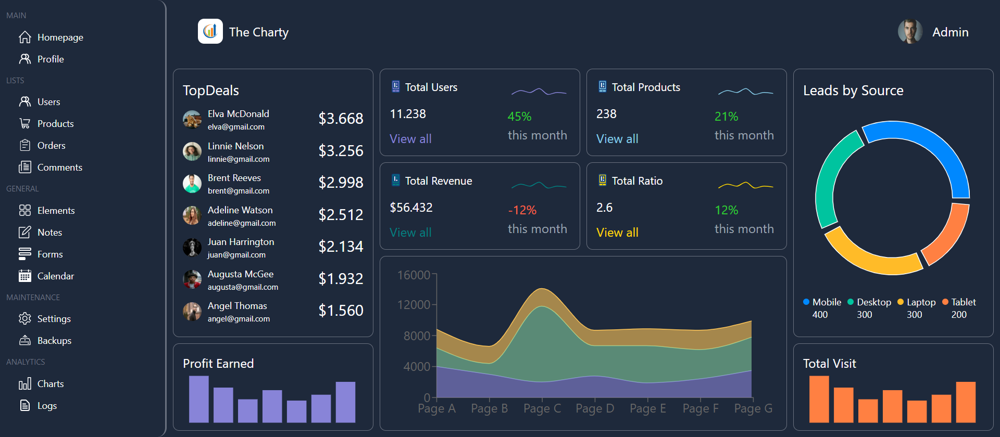

# The Charty - React Admin Dashboard

I have developed a comprehensive admin dashboard utilizing React for the front-end framework, Chart.js for dynamic data visualization, and Tailwind CSS for efficient and responsive styling. This combination allows for a seamless user experience with interactive charts and an attractive, mobile-friendly design.

## Live Demo:[The Charty](https://dashbord-mocha.vercel.app/)

## Tech Stack

**Client:** React, Charts, TailwindCSS

<!-- **Server:** Node, Express -->

## Screenshots



## Run Locally

Clone the project

```bash
  git clone https://link-to-project
```

Go to the project directory

```bash
  cd my-project
```

Install dependencies

```bash
  npm install
```

Start the server

```bash
  npm run start
```

## Feedback

If you have any feedback, please reach out to me at farrukhhussainofficial@gmail.com

## 🔗 Links

[](https://farrukhhussain.vercel.app/)
[](https://www.linkedin.com/in/farrukh-hussain-1b8164259/)
